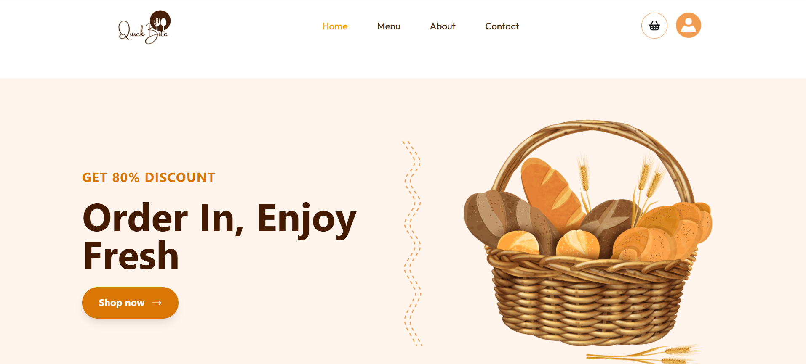
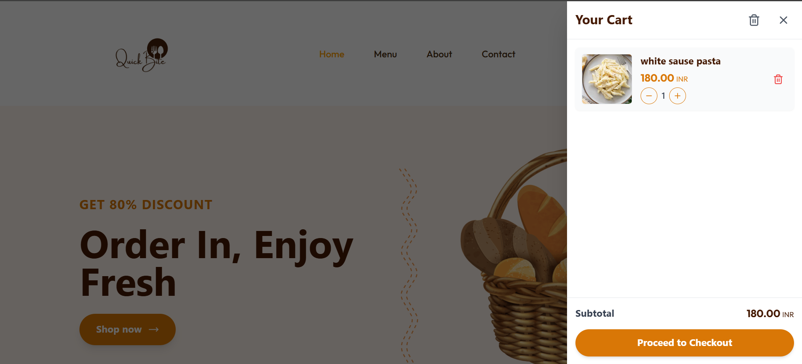

# 🍔 QuickBite – MERN Food Delivery App

🏠 Home Page

🛒Cart Page

👤Admin Page

# 🍔 MERN Food Delivery App A full-stack Food Delivery Web Application built using the MERN stack (MongoDB, Express.js, React, Node.js) with a powerful Admin Panel for managing food items and orders. The frontend was personally designed to offer a smooth and intuitive user experience. This project features admin and user authentication, cart management, order processing, and real-world backend architecture.

This project demonstrates **real-world backend architecture** with:

* ⚡ Redis caching for performance optimization
* 📡 Socket.io for real-time communication
* ⭐ Ratings & Reviews system
* 💳 Razorpay payment integration

## 🔗 Live Demo

* 👤 **User Panel:** https://food-delivery-vert-chi.vercel.app/
* 🛠️ **Admin Panel:** https://food-delivery-c2zb.vercel.app/
* ⚙️ **Backend API:** https://quickbite-backend-9cnh.onrender.com

## 🚀 Features

### 👤 User Panel

* 📦 Browse food items & categories
* 🛒 Add to cart & checkout
* 🔐 User authentication (Login/Register)
* 📋 View orders & order history
* ⭐ Rate & review food items

### 🛠️ Admin Panel

* 🔐 Admin authentication
* 📥 Add / Update / Delete food items
* 📊 Manage orders
* 👥 Manage users
* Update order status
  

---

## 📡 Real-Time Features (Socket.io)

* 🔄 Real-time order status updates
* 🔔 Instant notifications
* 📡 Live communication between client & server

---

## ⚡ Performance Optimization (Redis)

* 🚀 Implemented Redis caching using Upstash
* 📉 Reduced database load for frequently accessed APIs
* ⚡ Improved response time significantly
* 🔄 Cache invalidation for data consistency

---

## 🧰 Tech Stack

### 🎨 Frontend

* React
* React Router
* Tailwind CSS
* Axios

### ⚙️ Backend

* Node.js
* Express.js
* MongoDB (Mongoose)
* JWT Authentication
* Redis (Upstash)
* Socket.io

---

## 🛠️ Getting Started Locally

> 💡 Ensure Node.js, npm, and MongoDB are installed.

### 🔃 Clone the Repository

git clone https://github.com/nehap2110/Food-Delivery
cd food-delivery

---

## 🖥️ Run the Project

### ▶️ Frontend

cd client
npm install
npm run dev

### ▶️ Backend

cd server
npm install
npm run dev

### ▶️ Admin Panel

cd admin
npm install
npm run dev

---

## ⚙️ Environment Variables

### 🔧 Backend (.env)

PORT=5000
MONGO_URI=your_mongodb_connection_string
JWT_SECRET=your_jwt_secret

RAZORPAY_KEY_ID=your_razorpay_key_id
RAZORPAY_KEY_SECRET=your_razorpay_key_secret

CLOUDINARY_API_KEY=******
CLOUDINARY_API_SECRET=******
CLOUDINARY_CLOUD_NAME=yourname

UPSTASH_REDIS_REST_URL=https://******.upstash.io
UPSTASH_REDIS_REST_TOKEN=********

### 🌐 Frontend & Admin (.env)

VITE_RAZORPAY_KEY_ID=your_key
VITE_BACKEND_URL=http://localhost:4000

---

## 🔐 Admin Access

**POST** `/api/admin/register`

### Request Body:

{
  "name": "Admin Name",
  "email": "admin@mail.com",
  "password": "12345678"
}

### ✅ Demo Credentials

* Email: [admin@mail.com](mailto:admin@mail.com)
* Password: 1234567890

---

## 📈 Future Improvements

* 📍 Real-time order tracking UI
* 🔔 Push notifications
* 🎟️ Coupons & discounts
* 🤖 AI-based recommendations

---

## 🙋‍♀️ Author

Neha Patel

---

## ⭐ Support

If you like this project, don’t forget to **star ⭐ the repository!**
